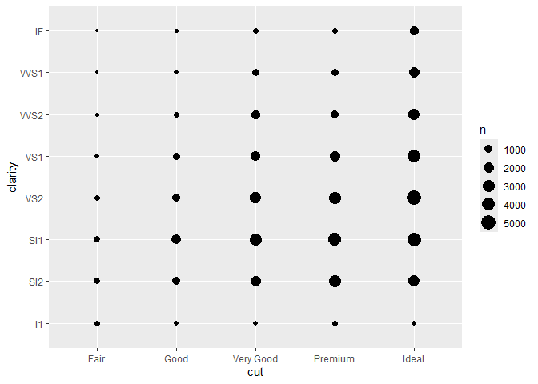
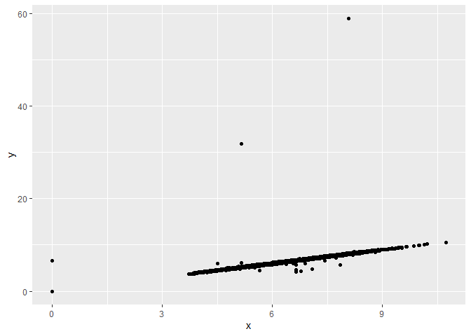
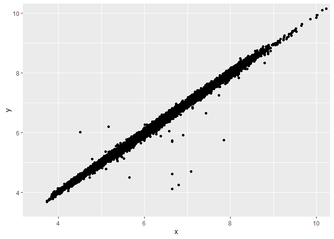

DataMiningAndWrangling_FA1_KHAFAJI
================

# Lecture 2

## Case Study: Diamonds

``` r
diamonds
```

    ## # A tibble: 53,940 × 10
    ##    carat cut       color clarity depth table price     x     y     z
    ##    <dbl> <ord>     <ord> <ord>   <dbl> <dbl> <int> <dbl> <dbl> <dbl>
    ##  1  0.23 Ideal     E     SI2      61.5    55   326  3.95  3.98  2.43
    ##  2  0.21 Premium   E     SI1      59.8    61   326  3.89  3.84  2.31
    ##  3  0.23 Good      E     VS1      56.9    65   327  4.05  4.07  2.31
    ##  4  0.29 Premium   I     VS2      62.4    58   334  4.2   4.23  2.63
    ##  5  0.31 Good      J     SI2      63.3    58   335  4.34  4.35  2.75
    ##  6  0.24 Very Good J     VVS2     62.8    57   336  3.94  3.96  2.48
    ##  7  0.24 Very Good I     VVS1     62.3    57   336  3.95  3.98  2.47
    ##  8  0.26 Very Good H     SI1      61.9    55   337  4.07  4.11  2.53
    ##  9  0.22 Fair      E     VS2      65.1    61   337  3.87  3.78  2.49
    ## 10  0.23 Very Good H     VS1      59.4    61   338  4     4.05  2.39
    ## # ℹ 53,930 more rows

Let’s recall some terminology from Lecture 1: • Variables: What do
variables in this dataset represent? How many of them are there? •
Observations: What do observations in this dataset represent? How many
of them are there? • Values: What are examples of values in this
dataset? • Continuous: Which variables are continuous? • Categorical:
Which variables are categorical? We can learn more about the variables
in this dataset by looking at the documentation:

``` r
?diamonds
```

    ## starting httpd help server ... done

## Exploratory Data Analysis

Before we start modeling our data, it’s a good idea to first explore it.
The goals of exploratory data analysis (EDA) are: • Gaining a basic
familiarity with the data • Exploring the variation of individual
variables (the tendency of the values of a variable to change from
observation to observation) • Exploring the covariation between pairs of
variables (the tendency for the values of two or more variables to vary
together in a related way) • Identifying and, if possible, fixing flaws
in the data • Searching for patterns and generating hypotheses We can
explore data by visualizing it or transforming it.

The subject of this lecture is the former: data visualization using
ggplot2. The figure below summarizes common strategies for visualizing
variation and covariation. We’ll go through each one in this lecture.

## Variation

### Discrete Variables

We usually use bar charts to visualize variation in discrete variables.
These can be created through geom_bar(), which requires the aesthetic x
(the variable whose variation we’d like to plot). Let’s take a look at
the variation in cut:

``` r
ggplot(data = diamonds) +
  geom_bar(mapping = aes(x = cut))
```

<!-- -->
What is the most common kind of diamond cut? The answer is the ideal
cut.

### Continuous Variables

We usually use histograms to visualize variation in continuous
variables. These can be created through geom_histogram(), which requires
the aesthetic x (the variable whose variation we’d like to plot). Let’s
take a look at the variation in carat:

``` r
ggplot(data = diamonds) +
  geom_histogram(mapping = aes(x = carat))
```

    ## `stat_bin()` using `bins = 30`. Pick better value with `binwidth`.

<!-- -->

What can be said about the variation in carat? Most diamonds are below 1
carats, but there is a spike in the one carat mark

Most of the values of carat are below 3, so let’s zoom in to that
portion of the plot using coord_cartesian:

``` r
ggplot(data = diamonds) +
  geom_histogram(mapping = aes(x = carat)) +
  coord_cartesian(xlim = c(0,3))
```

    ## `stat_bin()` using `bins = 30`. Pick better value with `binwidth`.

<!-- -->

Note the warning message about the number of bins. We might need to
experiment to find a meaningful value for the number of bins in a
histogram. Let’s try decreasing the bin width:

``` r
ggplot(data = diamonds) +
  geom_histogram(mapping = aes(x = carat), binwidth = 0.01) +
  coord_cartesian(xlim = c(0,3))
```

<!-- -->

That’s a peculiar pattern! What kinds of carat values do most diamonds
have? Why? – Most diamond jewellers tend to make diamonds with carats of
whole numbers.

## Covariation

### Discrete vs Discrete

We usually use count plots to visualize covariation between two discrete
variables. These represent the number of observations for which the two
variables take each combination of values via the size of points. Count
plots can be generated using geom_count(), and require x and y
aesthetics. For example, let’s assess the covariation between cut and
clarity:

``` r
ggplot(data = diamonds) +
  geom_count(mapping = aes(x = cut, y = clarity))
```

<!-- -->
What can we say about the relationship between cut and clarity? – Most
diamonds have mediocre clarity throughout all the cuts. However, ideal
cuts tend to have slightly better clarity.

### Continuous vs Continuous

#### Many to One

We usually use scatter plots to visualize covariation between two
continuous variables. These are useful when we can have many y values
for each x value. Scatter plots can be generated using geom_point(), and
require x and y aesthetics. For example, let’s assess the covariation
between x and y:

``` r
ggplot(data = diamonds) +
geom_point(mapping = aes(x = x, y = y))
```

<!-- -->

Whoa! There seem to be some weird outliers in the data. We should
probably look into those more and perhaps remove them. For now, let’s
just zoom in on the part of the plot where most of the points lie:

``` r
ggplot(data = diamonds) +
  geom_point(mapping = aes(x = x, y = y)) +
  coord_cartesian(xlim = c(3.5, 10), ylim = c(3.5,10))
```

<!-- -->

Hm! It looks like most of the points lie near the line y = x. To confirm
this, we can add that line to the plot via geom_abline():

``` r
ggplot(data = diamonds) +
geom_point(mapping = aes(x = x, y = y)) +
geom_abline(slope = 1, intercept = 0, color = "red") +
coord_cartesian(xlim = c(3.5, 10), ylim = c(3.5,10))
```

<!-- -->
Why might we have x and y approximately equal for most diamonds in this
dataset? – Since x and y are length and width of the diamonds,
respectively, most diamond designs aim to have a balanced design, making
a square, a diamond shape, or a circle, resulting in similar length and
width.

Why aren’t slope = 1, intercept = 0, and color = “red” inside of an
aes()? –because we are describing the ab line.

Note that horizontal and vertical lines may be added to plots using
geom_hline() and geom_vline(), respectively. Check out the details via
?geom_hline.

#### One to One

``` r
avg_price_by_carat <- diamonds %>%
  mutate(carat = round(carat, 1)) %>%
  group_by(carat) %>%
  summarise(avg_price = mean(price))
avg_price_by_carat
```

    ## # A tibble: 38 × 2
    ##    carat avg_price
    ##    <dbl>     <dbl>
    ##  1   0.2      506.
    ##  2   0.3      709.
    ##  3   0.4      936.
    ##  4   0.5     1590.
    ##  5   0.6     1861.
    ##  6   0.7     2619.
    ##  7   0.8     2998.
    ##  8   0.9     3942.
    ##  9   1       5437.
    ## 10   1.1     6011.
    ## # ℹ 28 more rows

To plot avg_price versus carat, we would use a line plot. We can create
a line plot via geom_line(), which requires both x and y aesthetics:

``` r
ggplot(data = avg_price_by_carat) +
geom_line(mapping = aes(x = carat, y = avg_price))
```

<!-- -->

What is the relationship between average price and carat? Does this make
sense? –As the carat increases, the average price also increases,
although not steadily. It makes sense as a whole, but the drops in
prices between 3 carats and 4 carats should be investigates: maybe this
is due to an error in the data, or due to variables relating to the sale
of the diamonds.

### Continuous vs Discrete

We usually use box plots to visualize covariation between a continuous
variable and a discrete variable. A single box plot is a way to
visualize the variation in a continuous variable, while side by side box
plots allow us to visualize how the distribution of a continuous
variable changes based on the values of a discrete variable.

We can construct side by side box plots via geom_boxplot(), which
requires x and y aesthetics. For example, let’s see how the price of a
diamond depends on its cut:

``` r
ggplot(data = diamonds) +
geom_boxplot(mapping = aes(x = cut, y = price))
```

<!-- -->

Those thick black lines in the middle denote the median price for each
cut. What trend do we observe in the median price based as the cut
improves? Is this what you would have expected?

– I am not sure what to think about the huge number of outliers, but
given that there are a few diamonds with a high clarity rating, thats to
be expected. Since most diamonds are under 1 carat, and have mediocre
quality, i think this boxplot gives valuable insight, but is to be
expected after analysing the previous graphs.

### Correlation Matrix

To get a more global view of the covariation in a dataset, we might want
to visualize its correlation matrix. A correlation is a number between
-1 and 1 that captures the strength of association between two
variables: 1 means perfectly correlated, 0 means uncorrelated, and -1
means perfectly anticorrelated. A correlation matrix visualizes the
correlations between all pairs of variables in a dataset. Computing the
correlation matrix requires a function from the stat471 R package called
mixed_cor():

``` r
library(correlation)
```

    ## Warning: package 'correlation' was built under R version 4.3.3

``` r
corrmat <- correlation::correlation(diamonds)
corrmat
```

    ## # Correlation Matrix (pearson-method)
    ## 
    ## Parameter1 | Parameter2 |     r |         95% CI | t(53938) |         p
    ## -----------------------------------------------------------------------
    ## carat      |      depth |  0.03 | [ 0.02,  0.04] |     6.56 | < .001***
    ## carat      |      table |  0.18 | [ 0.17,  0.19] |    42.89 | < .001***
    ## carat      |      price |  0.92 | [ 0.92,  0.92] |   551.41 | < .001***
    ## carat      |          x |  0.98 | [ 0.97,  0.98] |  1021.06 | < .001***
    ## carat      |          y |  0.95 | [ 0.95,  0.95] |   720.07 | < .001***
    ## carat      |          z |  0.95 | [ 0.95,  0.95] |   733.79 | < .001***
    ## depth      |      table | -0.30 | [-0.30, -0.29] |   -71.91 | < .001***
    ## depth      |      price | -0.01 | [-0.02,  0.00] |    -2.47 | 0.013*   
    ## depth      |          x | -0.03 | [-0.03, -0.02] |    -5.88 | < .001***
    ## depth      |          y | -0.03 | [-0.04, -0.02] |    -6.82 | < .001***
    ## depth      |          z |  0.09 | [ 0.09,  0.10] |    22.15 | < .001***
    ## table      |      price |  0.13 | [ 0.12,  0.14] |    29.77 | < .001***
    ## table      |          x |  0.20 | [ 0.19,  0.20] |    46.26 | < .001***
    ## table      |          y |  0.18 | [ 0.18,  0.19] |    43.42 | < .001***
    ## table      |          z |  0.15 | [ 0.14,  0.16] |    35.46 | < .001***
    ## price      |          x |  0.88 | [ 0.88,  0.89] |   440.16 | < .001***
    ## price      |          y |  0.87 | [ 0.86,  0.87] |   401.14 | < .001***
    ## price      |          z |  0.86 | [ 0.86,  0.86] |   393.60 | < .001***
    ## x          |          y |  0.97 | [ 0.97,  0.98] |  1012.79 | < .001***
    ## x          |          z |  0.97 | [ 0.97,  0.97] |   939.39 | < .001***
    ## y          |          z |  0.95 | [ 0.95,  0.95] |   722.36 | < .001***
    ## 
    ## p-value adjustment method: Holm (1979)
    ## Observations: 53940

We can plot this correlation matrix using the ggcorrplot() function from
the ggcorrplot package:

``` r
library(ggcorrplot)
```

    ## Warning: package 'ggcorrplot' was built under R version 4.3.3

``` r
ggcorrplot(corrmat, lab = TRUE, hc.order = TRUE)
```

<!-- -->
The ggcorrplot() function is highly customizable. The plot above was
created using lab = TRUE to add the correlation labels and hc.order =
TRUE to reorder the variables so that correlated ones appear next to
each other.

– note that the size of the diamond, the carat, and the price are
positively correlated.

## Alternative Visualization tools

### Axis Transformations

Some variable are better visualized on a transformed scale, e.g. on a
logarithmic scale. A tell-tale sign of a variable that would benefit
from a logarithmic transformation is a very long tail, as we saw with
carat

``` r
ggplot(data = diamonds) +
geom_histogram(aes(x = carat), binwidth = 0.01)
```

<!-- -->

We can put the x-axis on a logarithmic scale using scale_x_log10():

``` r
ggplot(data = diamonds) +
geom_histogram(aes(x = carat), binwidth = 0.01) +
scale_x_log10()
```

<!-- -->
The same goes for variables plotted on the y axis. For example:

``` r
ggplot(data = diamonds) +
geom_point(aes(x = carat, y = price)) +
scale_x_log10() +
scale_y_log10()
```

<!-- -->
Numerous ways can be made so that we can look at the data at a different
perspective.

### Multiple geoms in the same plot

We can add as many geoms as we want to the same plot. We’ve already seen
geom_point() and geom_abline() in the same plot. Let’s see another
example by adding the individual points to the plot of avg_price versus
carat:

``` r
ggplot(data = avg_price_by_carat) +
geom_line(mapping = aes(x = carat, y = avg_price)) +
geom_point(mapping = aes(x = carat, y = avg_price))
```

<!-- -->

Note that geom_line() and geom_point() have the same exact aesthetic
mapping. Any aesthetic mapping that applies to all geoms in a plot can
be placed inside of ggplot instead of inside the individual geoms. This
makes that aesthetic mapping “global”:

``` r
ggplot(data = avg_price_by_carat, mapping = aes(x = carat, y = avg_price)) +
geom_line() +
geom_point()
```

<!-- -->
– this mapping of different geoms helps us understand our data better,
or for this example, the lack of sample size better.

### Multiple aesthetics in the same geom

Any geom can have multiple aesthetics. We’ve already seen this,
e.g. specifying both x and y aesthetics for geom_point(). But we can add
still more aesthetics, e.g. color, for a richer plot. For example, let’s
consider plotting price versus carat:

``` r
ggplot(data = diamonds) +
geom_point(mapping = aes(x = carat, y = price))
```

<!-- -->

We can color points based on the cut of the diamond:

``` r
ggplot(data = diamonds) +
geom_point(mapping = aes(x = carat, y = price, color = cut))
```

<!-- -->
Altering the aesthetics of the geoms help us visualize the data better,
making its understanding intuitive.

### Faceting

Each plot so far has contained just one panel. Sometimes, we want to
break a plot into multiple panels based on the values of one or two
categorical variables in the data. For example, consider again the
relationship between price and carat. Instead of coloring points based
on cut, we can facet the plot based on cut. When using one faceting
variable, we would usually use facet_wrap():

``` r
ggplot(data = diamonds) +
geom_point(mapping = aes(x = carat, y = price)) +
facet_wrap(~cut)
```

<!-- -->

if we want all the panels to be in one row, we can also use
facet_grid():

``` r
ggplot(data = diamonds) +
geom_point(mapping = aes(x = carat, y = price)) +
facet_grid(. ~ cut)
```

<!-- -->

Usually though, facet_grid() is used to facet on two categorical
variables, creating a whole matrix of panels. For example:

``` r
ggplot(data = diamonds) +
geom_point(mapping = aes(x = carat, y = price)) +
facet_grid(clarity ~ cut)
```

<!-- -->
Altering the facets also give us a clear view of the data as it
separates the different segmentations.

### Plot Customization

Virtually every aspect of a plot can be customized (plot title, axis
titles, legend placement, font sizes, aspect ratio, etc). Work through
the Customize Plots tutorial and/or R4DS Chapter 28 to learn more. The
most important reason to customize your plots is to make them easier to
read and interpret. In addition to correctness, your homework and exams
will be graded on presentation quality, including the quality of your
plots. See Section 4 of preparing-reports.pdf on Canvas for concrete
guidelines.

## References:

ggplot2 cheat sheet • Visualize Data tutorials • R4DS Chapters 3 and 28
• preparing reports for STAT 4710

## Exercises

## Relating the carat and cut of a diamond

Recall this plot:

<!-- -->
What relationship does it suggest between carat and cut? Create a plot
to directly visualize this relationship. What do you conclude? How does
this explain the paradoxical trend we found in the plot below?

– the plot suggests that the prices rise with the carat, although there
is also a lot of carats with ideal cuts and low prices.

``` r
ggplot(data = diamonds) +
geom_boxplot(mapping = aes(x = cut, y = price))
```

<!-- -->
the above plot gives a clear picture to the phenomena. Although ideal
cuts have the lowest median price among all cuts, premium and very good
cuts have the longest whiskers and 75th percentiles.

### Relating the size and carat of a diamond

Create a plot to visualize the relationship between the carat and length
of a diamond. Zoom in to exclude any outliers. What sort of relationship
does your plot suggest? How would you explain this relationship?

``` r
ggplot(data = avg_price_by_carat) +
geom_line(mapping = aes(x = carat, y = avg_price)) +
geom_point(mapping = aes(x = carat, y = avg_price))
```

<!-- -->

The graph points out that as the carat increases, the price steadily
increases, although plateuing at the end.
