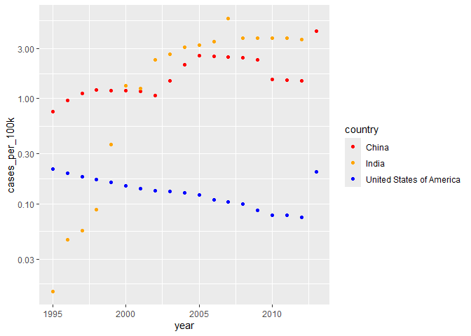
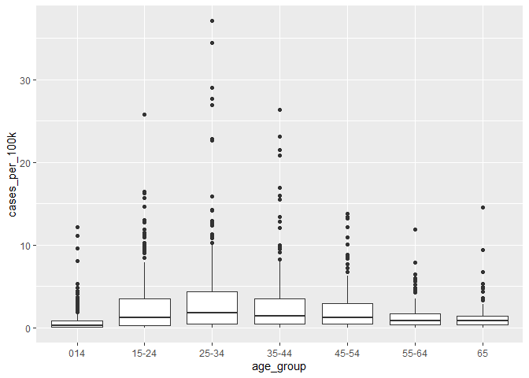
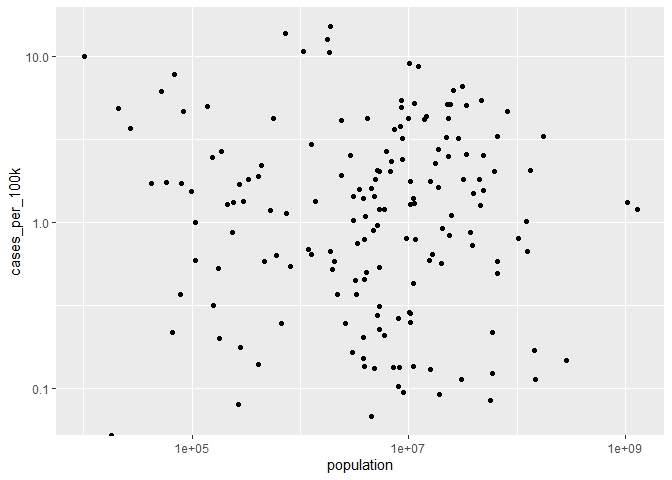

FA2_KHAFAJI_DATA_MINING
================

# FA2 - Data Wrangling, Manipulation, and Visualization

We first want to get the tibbles of Information about TB cases in
various countries from 1980 to 2013, and Population data of each country
across time.

``` r
tb_data <- as_tibble(who)
head(tb_data)
```

    ## # A tibble: 6 × 60
    ##   country   iso2  iso3   year new_sp_m014 new_sp_m1524 new_sp_m2534 new_sp_m3544
    ##   <chr>     <chr> <chr> <dbl>       <dbl>        <dbl>        <dbl>        <dbl>
    ## 1 Afghanis… AF    AFG    1980          NA           NA           NA           NA
    ## 2 Afghanis… AF    AFG    1981          NA           NA           NA           NA
    ## 3 Afghanis… AF    AFG    1982          NA           NA           NA           NA
    ## 4 Afghanis… AF    AFG    1983          NA           NA           NA           NA
    ## 5 Afghanis… AF    AFG    1984          NA           NA           NA           NA
    ## 6 Afghanis… AF    AFG    1985          NA           NA           NA           NA
    ## # ℹ 52 more variables: new_sp_m4554 <dbl>, new_sp_m5564 <dbl>,
    ## #   new_sp_m65 <dbl>, new_sp_f014 <dbl>, new_sp_f1524 <dbl>,
    ## #   new_sp_f2534 <dbl>, new_sp_f3544 <dbl>, new_sp_f4554 <dbl>,
    ## #   new_sp_f5564 <dbl>, new_sp_f65 <dbl>, new_sn_m014 <dbl>,
    ## #   new_sn_m1524 <dbl>, new_sn_m2534 <dbl>, new_sn_m3544 <dbl>,
    ## #   new_sn_m4554 <dbl>, new_sn_m5564 <dbl>, new_sn_m65 <dbl>,
    ## #   new_sn_f014 <dbl>, new_sn_f1524 <dbl>, new_sn_f2534 <dbl>, …

``` r
population_data <- as_tibble(population)
head(population_data)
```

    ## # A tibble: 6 × 3
    ##   country      year population
    ##   <chr>       <dbl>      <dbl>
    ## 1 Afghanistan  1995   17586073
    ## 2 Afghanistan  1996   18415307
    ## 3 Afghanistan  1997   19021226
    ## 4 Afghanistan  1998   19496836
    ## 5 Afghanistan  1999   19987071
    ## 6 Afghanistan  2000   20595360

``` r
dim(tb_data)
```

    ## [1] 7240   60

``` r
dim(population_data)
```

    ## [1] 4060    3

``` r
sapply(population_data, class)
```

    ##     country        year  population 
    ## "character"   "numeric"   "numeric"

Since everything looks alright with the data types, we can proceed with
further cleaning the tb dataset.

## 3 Tidying Data

### 3.1

For the WHO tuberculosis dataset, we’ll need country, iso2, iso3, year,
TB type, sex, and age group

``` r
who2 <- pivot_longer(tb_data, -c("country", "year", "iso2", "iso3"), names_to = "TBType_Sex_AgeGroup", values_to = "Cases")

head(who2)
```

    ## # A tibble: 6 × 6
    ##   country     iso2  iso3   year TBType_Sex_AgeGroup Cases
    ##   <chr>       <chr> <chr> <dbl> <chr>               <dbl>
    ## 1 Afghanistan AF    AFG    1980 new_sp_m014            NA
    ## 2 Afghanistan AF    AFG    1980 new_sp_m1524           NA
    ## 3 Afghanistan AF    AFG    1980 new_sp_m2534           NA
    ## 4 Afghanistan AF    AFG    1980 new_sp_m3544           NA
    ## 5 Afghanistan AF    AFG    1980 new_sp_m4554           NA
    ## 6 Afghanistan AF    AFG    1980 new_sp_m5564           NA

``` r
who3 <- who2 %>% 
  separate_wider_delim(TBType_Sex_AgeGroup, "_", names = c(NA, "TB_type", "Sex_AgeGroup"), too_few = "align_end") %>% 
  mutate(TB_type = str_remove_all(TB_type, c("new")) ) 

head(who3)
```

    ## # A tibble: 6 × 7
    ##   country     iso2  iso3   year TB_type Sex_AgeGroup Cases
    ##   <chr>       <chr> <chr> <dbl> <chr>   <chr>        <dbl>
    ## 1 Afghanistan AF    AFG    1980 sp      m014            NA
    ## 2 Afghanistan AF    AFG    1980 sp      m1524           NA
    ## 3 Afghanistan AF    AFG    1980 sp      m2534           NA
    ## 4 Afghanistan AF    AFG    1980 sp      m3544           NA
    ## 5 Afghanistan AF    AFG    1980 sp      m4554           NA
    ## 6 Afghanistan AF    AFG    1980 sp      m5564           NA

``` r
who_tidy <- who3 %>% 
  separate(Sex_AgeGroup, into = c("sex", "age_group"), sep = "(?<=[A-Za-z])(?=[0-9])") %>%
  mutate(age_group = str_replace_all(age_group, "(\\d{2})(?=\\d{2}$)", "\\1-") )

head(who_tidy)
```

    ## # A tibble: 6 × 8
    ##   country     iso2  iso3   year TB_type sex   age_group Cases
    ##   <chr>       <chr> <chr> <dbl> <chr>   <chr> <chr>     <dbl>
    ## 1 Afghanistan AF    AFG    1980 sp      m     014          NA
    ## 2 Afghanistan AF    AFG    1980 sp      m     15-24        NA
    ## 3 Afghanistan AF    AFG    1980 sp      m     25-34        NA
    ## 4 Afghanistan AF    AFG    1980 sp      m     35-44        NA
    ## 5 Afghanistan AF    AFG    1980 sp      m     45-54        NA
    ## 6 Afghanistan AF    AFG    1980 sp      m     55-64        NA

Since the WHO tuberculosis dataset

Since we have essentially fixed the structure of our tuberculosis table,
we can then proceed with other endeavors.

### 3.2

For the population dataset, We’ll need the country, year, and
population.

``` r
population_tidy <- population_data

head(population_tidy)
```

    ## # A tibble: 6 × 3
    ##   country      year population
    ##   <chr>       <dbl>      <dbl>
    ## 1 Afghanistan  1995   17586073
    ## 2 Afghanistan  1996   18415307
    ## 3 Afghanistan  1997   19021226
    ## 4 Afghanistan  1998   19496836
    ## 5 Afghanistan  1999   19987071
    ## 6 Afghanistan  2000   20595360

Since the data looks golden, we can use it as is.

### 3.3 Joining Datasets.

We can now then join the two datasets, using left join. We need to match
the Country and the Year. This is the default behavior of left_join,
joining with “by = join_by(country, year)”

``` r
tuberculosis <- left_join(who_tidy, population_tidy)
```

    ## Joining with `by = join_by(country, year)`

``` r
head(tuberculosis)
```

    ## # A tibble: 6 × 9
    ##   country     iso2  iso3   year TB_type sex   age_group Cases population
    ##   <chr>       <chr> <chr> <dbl> <chr>   <chr> <chr>     <dbl>      <dbl>
    ## 1 Afghanistan AF    AFG    1980 sp      m     014          NA         NA
    ## 2 Afghanistan AF    AFG    1980 sp      m     15-24        NA         NA
    ## 3 Afghanistan AF    AFG    1980 sp      m     25-34        NA         NA
    ## 4 Afghanistan AF    AFG    1980 sp      m     35-44        NA         NA
    ## 5 Afghanistan AF    AFG    1980 sp      m     45-54        NA         NA
    ## 6 Afghanistan AF    AFG    1980 sp      m     55-64        NA         NA

### 3.4 Cleaning data

We need to filter out rows with NA. We should also remove columns that
we won’t have use for.

``` r
tuberculosis <- tuberculosis %>% 
  select(-c("iso2", "iso3")) %>%
  drop_na()
  

head(tuberculosis)
```

    ## # A tibble: 6 × 7
    ##   country      year TB_type sex   age_group Cases population
    ##   <chr>       <dbl> <chr>   <chr> <chr>     <dbl>      <dbl>
    ## 1 Afghanistan  1997 sp      m     014           0   19021226
    ## 2 Afghanistan  1997 sp      m     15-24        10   19021226
    ## 3 Afghanistan  1997 sp      m     25-34         6   19021226
    ## 4 Afghanistan  1997 sp      m     35-44         3   19021226
    ## 5 Afghanistan  1997 sp      m     45-54         5   19021226
    ## 6 Afghanistan  1997 sp      m     55-64         2   19021226

## 4. Data Manipulation

Next, we want to know the tuberculosis cases per 100,000 by year, sex,
age group, and TB Type.

``` r
tuberculosis_100k_year <- tuberculosis %>% 
  group_by(country, year) %>%
  summarise(cases_per_100k = mean(Cases/population*100000))
```

    ## `summarise()` has grouped output by 'country'. You can override using the
    ## `.groups` argument.

``` r
head(tuberculosis_100k_year)
```

    ## # A tibble: 6 × 3
    ## # Groups:   country [1]
    ##   country      year cases_per_100k
    ##   <chr>       <dbl>          <dbl>
    ## 1 Afghanistan  1997         0.0481
    ## 2 Afghanistan  1998         0.651 
    ## 3 Afghanistan  1999         0.266 
    ## 4 Afghanistan  2000         0.925 
    ## 5 Afghanistan  2001         1.55  
    ## 6 Afghanistan  2002         2.09

from here, we can identify the country and year with the highest and
lowest cases per 100k:

``` r
max_year = max(tuberculosis_100k_year$cases_per_100k)
min_year = min(tuberculosis_100k_year$cases_per_100k)


tuberculosis_100k_year %>% 
  filter(cases_per_100k == max_year | cases_per_100k == min_year) %>%
  arrange(desc(cases_per_100k))
```

    ## # A tibble: 49 × 3
    ## # Groups:   country [17]
    ##    country                            year cases_per_100k
    ##    <chr>                             <dbl>          <dbl>
    ##  1 Niue                               2011           70.1
    ##  2 Anguilla                           2004            0  
    ##  3 Anguilla                           2011            0  
    ##  4 Anguilla                           2012            0  
    ##  5 Anguilla                           2013            0  
    ##  6 Barbados                           2011            0  
    ##  7 Barbados                           2012            0  
    ##  8 Bermuda                            2004            0  
    ##  9 Bermuda                            2013            0  
    ## 10 Bonaire, Saint Eustatius and Saba  2010            0  
    ## # ℹ 39 more rows

Niue in 2011 had the highest incidence rate among all the countries in
the dataset. While numerous countries, in various years, have had 0
cases per 100k.

``` r
head(tuberculosis %>% 
  group_by(country, TB_type) %>%
  summarise(cases_per_100k = mean(Cases/population*100000)))
```

    ## `summarise()` has grouped output by 'country'. You can override using the
    ## `.groups` argument.

    ## # A tibble: 6 × 3
    ## # Groups:   country [2]
    ##   country     TB_type cases_per_100k
    ##   <chr>       <chr>            <dbl>
    ## 1 Afghanistan ep               0    
    ## 2 Afghanistan rel              5.65 
    ## 3 Afghanistan sn               1.30 
    ## 4 Afghanistan sp               2.28 
    ## 5 Albania     ep               0.325
    ## 6 Albania     rel              1.07

``` r
head(
tuberculosis %>% 
  group_by(country, sex) %>%
  summarise(cases_per_100k = mean(Cases/population*100000))
)
```

    ## `summarise()` has grouped output by 'country'. You can override using the
    ## `.groups` argument.

    ## # A tibble: 6 × 3
    ## # Groups:   country [3]
    ##   country     sex   cases_per_100k
    ##   <chr>       <chr>          <dbl>
    ## 1 Afghanistan f              3.11 
    ## 2 Afghanistan m              1.38 
    ## 3 Albania     f              0.255
    ## 4 Albania     m              0.488
    ## 5 Algeria     f              1.32 
    ## 6 Algeria     m              2.02

``` r
tuberculosis_100k_age <-
  tuberculosis %>% 
  group_by(country, age_group) %>%
  summarise(cases_per_100k = mean(Cases/population*100000))
```

    ## `summarise()` has grouped output by 'country'. You can override using the
    ## `.groups` argument.

``` r
head(tuberculosis_100k_age)
```

    ## # A tibble: 6 × 3
    ## # Groups:   country [1]
    ##   country     age_group cases_per_100k
    ##   <chr>       <chr>              <dbl>
    ## 1 Afghanistan 014                 1.27
    ## 2 Afghanistan 15-24               3.60
    ## 3 Afghanistan 25-34               3.72
    ## 4 Afghanistan 35-44               2.53
    ## 5 Afghanistan 45-54               1.87
    ## 6 Afghanistan 55-64               1.51

## 5. Data Visualization

Plot the total cases per 100k as a function of year for China, India,
and the United States:

Use a log scale on the y-axis (scale_y_log10()). Describe emerging
patterns.

``` r
tuberculosis_100k_year %>%
  filter(country %in% c("United States of America", "China", "India")) %>%
  ggplot(aes(x=year, y=cases_per_100k, color=country))+
  geom_point()+
  scale_color_manual(values = c("United States of America" = "blue", "China" = "red", "India" = "orange"))+
  scale_y_log10()
```

<!-- -->
We can see that the incidence rate in the united states is dropping
down. In contrast, China’s have remained relatively stagnant, while
India’s have risen drastically, although both have, at recent times,
curbed the exponential increase in the incidence rate.

``` r
tuberculosis_100k_age %>% 
  ggplot(aes(x=age_group, y=cases_per_100k))+
  geom_boxplot()
```

<!-- -->

The incidence rates were highest at the age range of 25-34, and 35-44.
It is lowest in 0-14 and 65 above.

``` r
left_join(tuberculosis_100k_year, population_tidy) %>% filter(year == 2000) %>%
  ggplot(aes(x=population, y=cases_per_100k))+
  geom_point()+
  scale_y_log10()+
  scale_x_log10()
```

    ## Joining with `by = join_by(country, year)`

    ## Warning in scale_y_log10(): log-10 transformation introduced infinite values.

<!-- -->

The population of a country has little to do with its incidence rate in
the 2000s.
